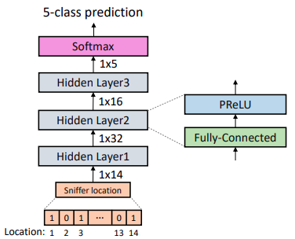
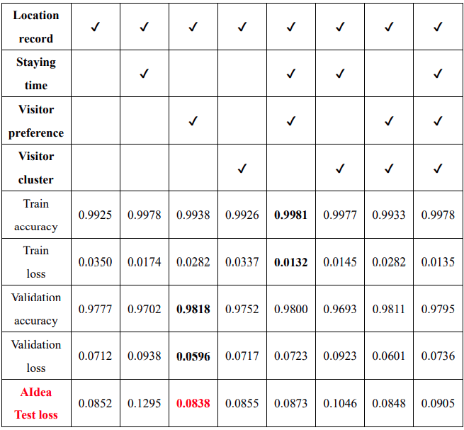
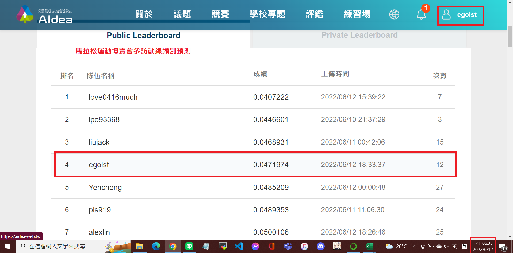

# 馬拉松運動博覽會參訪動線類別預測
This is a machine learning task released on [AIdea][1].

## Dataset
Dataset includes the following features:
- Sniffer location
- Create time

## Models
### Transformer + LSTM (GRU)


### Fully-Connected Neural Network (FC-NN)


### XGBoost
XGBoost is a conventional machine learning method. Model details are omitted here.

## Usage
### Train
1. Transformer + LSTM
    ```
    python train.py -m Transformer
    ```
2. FC-NN
    ```
    python train.py -m FCNN
    ```
3. XGBoost

    Run `xgboost.ipynb` directly.

### Evalute
1. Transformer + LSTM
    ```
    python eval.py -m Transformer
    ```
2. FC-NN
    ```
    python eval.py -m FCNN
    ```
3. XGBoost

    Run `xgboost.ipynb` directly.

## Ablation Study
The following is the ablation study for the four differnt input features trained on XGBoost model. More details about the four features can be seen in `document/Team18_final_report.pdf`.


## Result
FC-NN outperforms than the other two models we proposed, and our best testing loss on AIdea is 0.0471974.


## Backup
All experimental results and details about data preprocessing, training framework, and model architecture are record in `document/Team18_final_report.pdf`

[1]:https://aidea-web.tw/topic/107d9eb3-5a37-4303-9e60-11bebef82f51